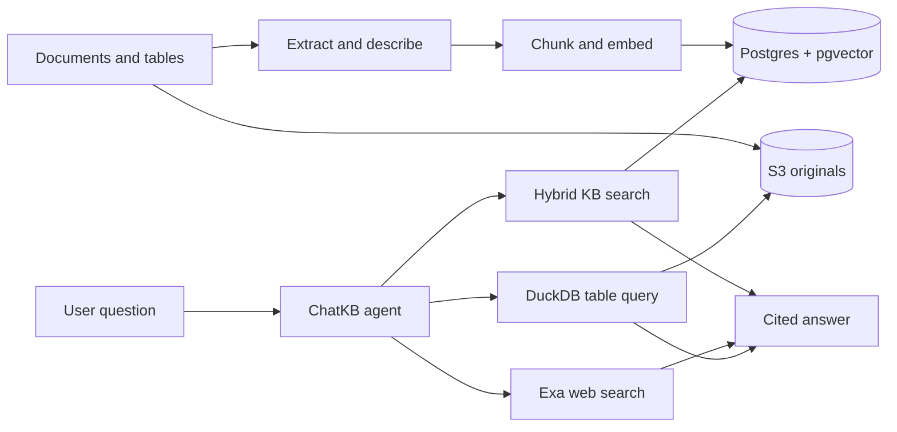

# ChatKB

Chat with your documents, build purpose-specific AI agents, and combine trusted
knowledge with live web research.

ChatKB turns PDFs, Office documents, text, and structured data into searchable
knowledge bases. Agents can answer with document-level citations, query tables,
and fall back to internet search when the attached knowledge does not contain
the answer.

## What you can do

- **Build knowledge bases** from PDF, DOCX, Markdown, text, CSV, TSV, and JSON.
- **Ask grounded questions** using hybrid semantic and full-text retrieval.
- **Create custom agents** with their own instructions, attached knowledge, and
  optional Exa web search.
- **Understand visual documents** by extracting and describing PDF images and
  charts.
- **Query structured files** with guarded, read-only DuckDB SQL.
- **Inspect sources** through inline citations, page references, and document
  previews.
- **Stream responses and tool activity** as the agent searches, reasons, and
  answers.
- **Capture product and answer feedback** in Langfuse.

## How it works



Knowledge-base search is preferred when an agent has attached documents. Web
search fills gaps or supplies fresh public information.

See [the technical architecture](docs/architecture.md) for detailed ingestion,
extraction, retrieval, chat, agent, and observability diagrams.

## Technology

- **Frontend:** React 19, TypeScript, Vite, Tailwind CSS
- **Backend:** FastAPI, SQLAlchemy, asyncpg
- **Retrieval:** PostgreSQL, pgvector, Gemini embeddings, reciprocal-rank fusion
- **Document processing:** Docling, multimodal LLM descriptions
- **Structured data:** DuckDB
- **Storage:** AWS S3
- **Research:** Exa
- **Observability:** Langfuse

## Repository layout

```text
frontend/   React application
backend/    FastAPI API, ingestion, retrieval, and agents
docs/       Architecture and technical flows
```

## Run locally

### 1. Start PostgreSQL

```bash
docker run -d \
  --name chatkb-postgres-dev \
  -e POSTGRES_USER=chatkb \
  -e POSTGRES_PASSWORD=chatkb \
  -e POSTGRES_DB=chatkb \
  -p 5433:5432 \
  -v chatkb-postgres-dev:/var/lib/postgresql/data \
  pgvector/pgvector:pg16
```

### 2. Start the backend

Follow [the backend setup guide](backend/README.md) to create the Python
environment and configure `backend/.env`, then run:

```bash
conda activate chatkb
cd backend
alembic upgrade head
uvicorn app.main:create_app --factory --reload
```

The API runs at `http://127.0.0.1:8000`; health is available at `/health`.

### 3. Start the frontend

```bash
cd frontend
npm install
npm run dev
```

Open `http://localhost:5173`. The example local users are `alice` and `bob`
with password `changeme`; replace these credentials before deployment.

## Deploy with Docker Compose

The production stack includes Nginx, FastAPI, a one-shot Alembic migration, and
PostgreSQL with pgvector.

Create and configure the deployment environment:

```bash
cp .env.docker.example .env.docker
openssl rand -hex 32
```

Use generated values for `POSTGRES_PASSWORD` and `JWT_SECRET`, then replace every
`replace-me` value. Generate login password hashes from the backend environment:

```bash
cd backend
python -c "from passlib.context import CryptContext; print(CryptContext(schemes=['bcrypt']).hash('your-password'))"
```

Keep `AUTH_USERS` single-quoted so bcrypt `$` characters remain literal:

```dotenv
AUTH_USERS='{"admin":"$2b$12$replace_with_the_generated_hash"}'
```

Start and verify the stack from the repository root:

```bash
docker compose --env-file .env.docker up --build -d
docker compose --env-file .env.docker ps
set -a; . ./.env.docker; set +a
curl --fail http://localhost:${APP_PORT:-80}/healthz
curl --fail http://localhost:${APP_PORT:-80}/api/health
```

Open `http://localhost:${APP_PORT:-80}`. API documentation is at `/api/docs`.

### Existing database volumes

Changing `POSTGRES_PASSWORD` does not update a database already initialized in
the `chatkb_chatkb_postgres` volume. Rotate the stored password before starting
the full stack:

```bash
docker compose --env-file .env.docker up -d postgres
docker compose --env-file .env.docker exec postgres psql -U chatkb -d chatkb
# At the psql prompt: \password chatkb
```

### Production notes

- Put a TLS-terminating proxy or load balancer in front of `APP_PORT`.
- Add the public frontend origin to the S3 CORS policy in
  [the backend guide](backend/README.md#s3-cors-for-the-pdf-viewer).
- Run one backend replica. Response-resume buffers live in process memory.
- `/api/health` is a liveness check; it does not probe S3 or model providers.
- Back up `chatkb_chatkb_postgres` before upgrades.
- Never run `docker compose down -v` unless you intend to delete stored data.

Useful operations:

```bash
# Follow application logs
docker compose --env-file .env.docker logs -f frontend backend migrate

# Rebuild after pulling a release
docker compose --env-file .env.docker up --build -d

# Stop containers without deleting volumes
docker compose --env-file .env.docker down
```
