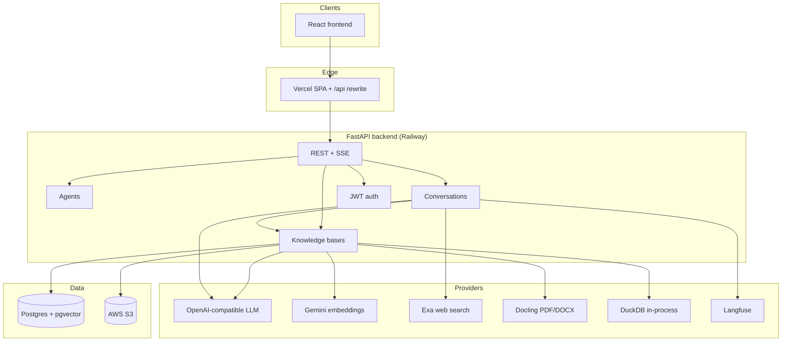
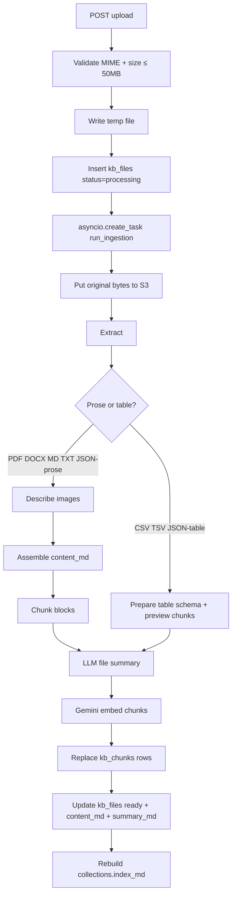
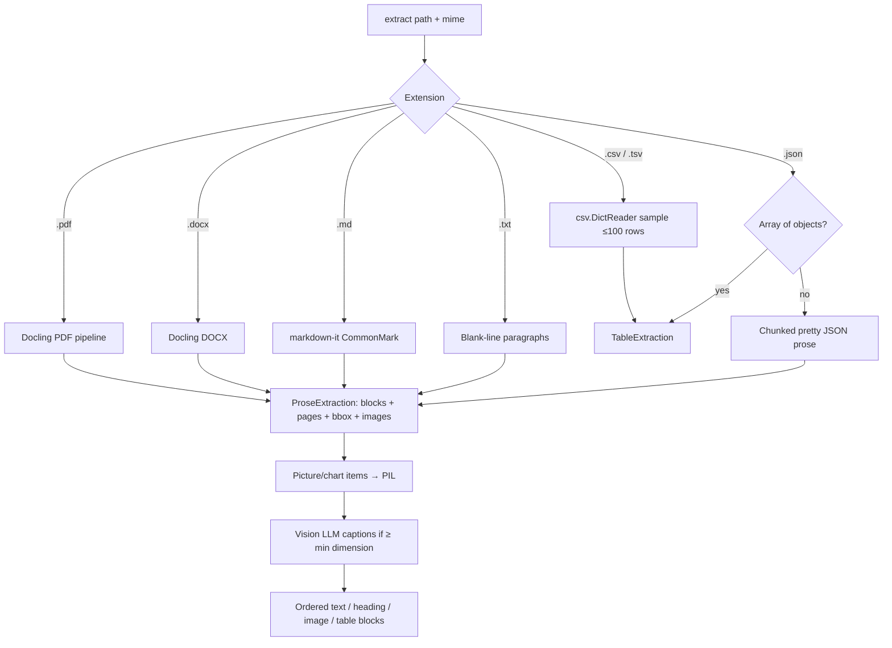
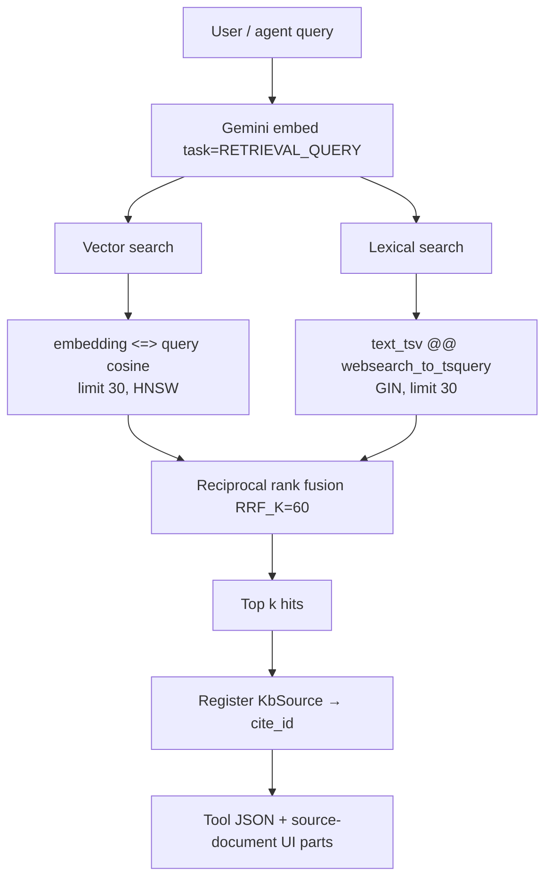
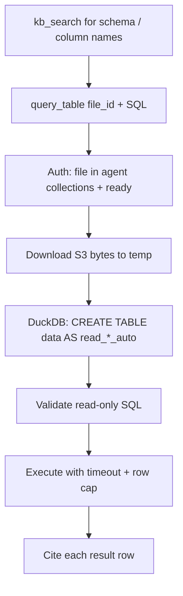
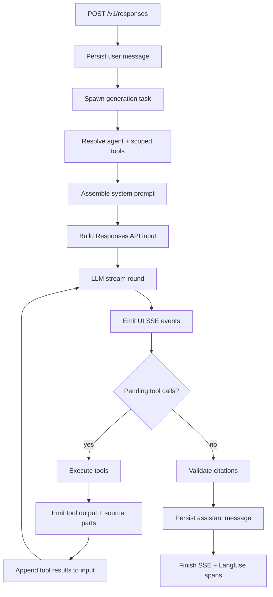
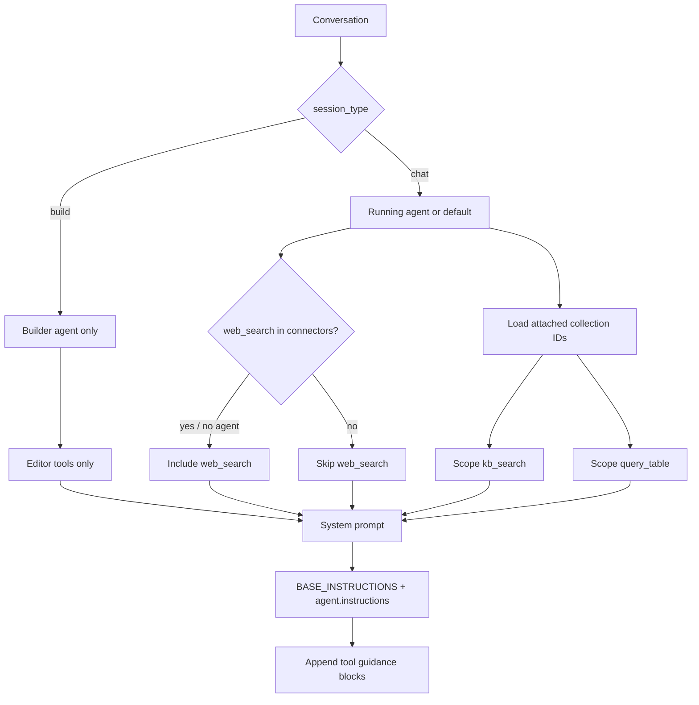

# ChatKB technical architecture

This document describes the main backend feature flows: knowledge-base ingestion, extraction, retrieval, tabular query, chat turns, and agents. Diagrams use Mermaid.

## System overview

| Concern | Technology |
|---------|------------|
| API | FastAPI, uvicorn (single process) |
| Metadata + vectors | PostgreSQL 16, pgvector (HNSW cosine) |
| Raw files | AWS S3 (presigned GET for PDF viewer) |
| PDF / DOCX parse | Docling (`DocumentConverter` process singleton) |
| Embeddings | Gemini `gemini-embedding-001` (1536 dims) |
| Chat / vision / summaries | OpenAI-compatible Responses API |
| Web search | Exa |
| Tabular SQL | DuckDB over S3 bytes |
| Tracing | Langfuse (optional) |

---

## 1. Knowledge-base ingestion

Upload returns immediately. Processing continues in a background task until the file is `ready` or `failed`.

**Code path**

| Stage | Location |
|-------|----------|
| Upload API | `app/features/kb/router.py` → `KbService.upload_file` |
| Pipeline | `app/features/kb/ingestion/pipeline.py` (`run_ingestion`) |
| Extract | `app/features/kb/ingestion/extract.py` |
| Image captions | `app/features/kb/ingestion/describe_image.py` |
| Chunk | `app/features/kb/ingestion/chunk.py` |
| Table prepare | `app/features/kb/ingestion/table.py` |
| Summaries | `app/features/kb/ingestion/assemble.py` + `prompts.py` |
| Embed | `app/features/kb/ingestion/embed.py` |
| Persist | `app/features/kb/db.py` |

**What is stored where**

| Artifact | Store |
|----------|-------|
| Original file bytes | S3 key `{owner_id}/{file_id}{ext}` |
| File metadata, `content_md`, `summary_md`, status | `kb_files` |
| Searchable text + embedding + page/anchor/bbox | `kb_chunks` (+ generated `text_tsv`) |
| Collection catalog of file summaries | `collections.index_md` |
| Image pixels | Not stored; captions only |

---

## 2. Extraction (what runs per format)

**Docling settings (PDF)** — OCR off, table structure on, picture images at scale 2.0. Converter is a **process-wide singleton** (`get_converter`) because model init is expensive.

**Block fields:** `text`, `block_type`, `page`, `anchor`, `bbox` (normalized for PDF), `is_heading`.

**Chunking (prose):** headings update section context only; non-heading blocks become chunks with the current header prepended; oversized text splits near 2000 tokens (~4 chars/token).

**Standalone tables:** only a schema chunk and a short markdown preview are embedded. Full rows stay on S3 for `query_table`.

---

## 3. Retrieval (`kb_search`)

Agents call `kb_search` scoped to attached collection IDs. Default tool return size is top **5** after fusion.

**Code:** `app/features/kb/retrieve.py` (`hybrid_search`), `app/features/kb/tools.py` (`KbSearchTool`).

**Citation contract:** model must write `[cite:<cite_id>]` using IDs returned by tools. Invalid cites are stripped on validation.

**Tool policy (system prompt):** when both KB and web are available, search the knowledge base first; use `web_search` only if KB is empty/unhelpful or needs fresh public data (`KB_SEARCH_GUIDANCE` in `app/features/agents/wrapper.py`).

---

## 4. Tabular query (`query_table`)

**Guards:** SELECT-only, must reference table `data`, blocked DML/DDL, 5s timeout, ≤100 rows, concurrency and memory limits.

**Code:** `app/features/kb/tools.py` (`QueryTableTool`), `app/features/kb/query.py`.

---

## 5. Chat turn (streaming agent loop)

**Limits:** up to 8 tool rounds per turn. Stream buffer is **in-process memory** (single replica / single worker required).

**Code:** `app/features/conversations/service.py` (`run_generation`, `_run_agent_loop`), `app/core/llm/client.py`.

---

## 6. Agents, tools, and prompts

| Tool | When | Backend |
|------|------|---------|
| `web_search` | Chat; connector allows (default on new agents) | Exa |
| `kb_search` | Chat; scoped to collections | Hybrid search |
| `query_table` | Chat; scoped to collections | DuckDB |
| `get_agent_setup` / `update_*` / `list_knowledge_bases` / `attach_knowledge_bases` | Build session only | Agent editor |

**Prompt assembly**

1. `BASE_INSTRUCTIONS` (+ agent `instructions` if any) — `wrapper.py`
2. `WEB_SEARCH_GUIDANCE` if web tool present
3. `KB_SEARCH_GUIDANCE` if KB tool present
4. `QUERY_TABLE_GUIDANCE` if query_table present

Builder instructions live in `app/features/agents/builder.py`.

---

## 7. Auth and feedback

| Feedback | Endpoint | Sink |
|----------|----------|------|
| Thumbs on message | `PUT …/messages/{id}/feedback` | Langfuse score on turn (seed = assistant message id) |
| Product opened | `POST /v1/product/opened` | Langfuse |
| Experience comment | `POST /v1/feedback` | Langfuse |

---

## 8. Observability spans

| Name | Kind |
|------|------|
| `conversation.turn` | Root trace (seeded by assistant message id) |
| `llm.generation` | Each agent-loop round |
| `tool.<name>` | Each tool call |
| `citations` | Post-turn cite validation |
| `product.opened` / `product.feedback` | Product telemetry |

---

## Key source index

| Area | Paths under `backend/app/` |
|------|----------------------------|
| KB service / API | `features/kb/service.py`, `router.py`, `db.py`, `models.py` |
| Ingestion | `features/kb/ingestion/{pipeline,extract,chunk,embed,assemble,table,describe_image,prompts}.py` |
| Retrieval | `features/kb/retrieve.py`, `tools.py`, `query.py` |
| Chat | `features/conversations/service.py`, `router.py`, `buffer.py` |
| Agents | `features/agents/{wrapper,builder,tools,service}.py` |
| LLM / storage / tracing | `core/llm/client.py`, `core/storage.py`, `core/tracing.py`, `core/db.py` |
| Citations | `core/citations/` |
